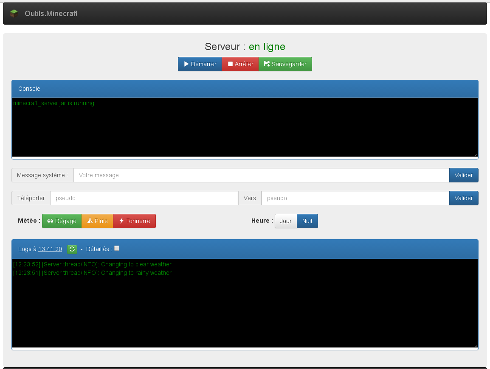

# MinecraftAdministration

A little and simple PHP script to administrate a minecraft Server.

## Pre-Requisites
* A Debian Linux server
* Minecraft server installed
* The init.d script installed : http://minecraft.gamepedia.com/Tutorials/Server_startup_script
* SSH activate : with private key for automatic authentification

## Installation
* Copy the script on a apache directory
* Configure the "//Variable utile à modifier"

## Features
* Stop / Start / Save the server
* Send a systeme message
* Teleport a player
* Change the weather
* Change the hour
* See the server logs

## Screenshot
